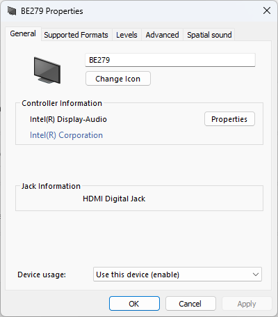
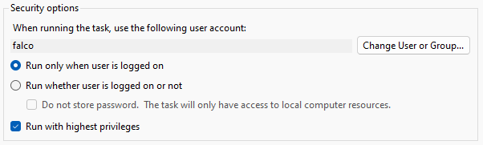
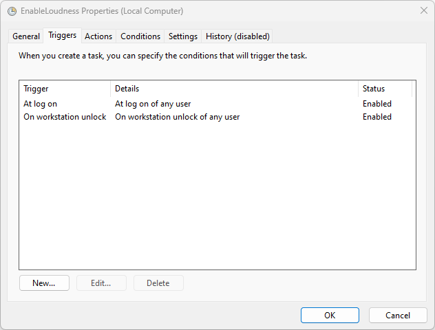
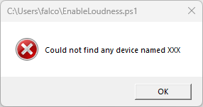

# Bật cân bằng âm lượng trên Windows

Dự án này thêm và bật **Loudness Equalisation** (cân bằng âm lượng) cho thiết bị phát âm thanh được chọn.

Script chỉ hoạt động khi trình điều khiển âm thanh đã có sẵn hiệu ứng này nhưng chưa hiển thị tùy chọn cho thiết bị đó. Script không thể bổ sung hiệu ứng nếu trình điều khiển không hỗ trợ.

| Trước khi chạy | Sau khi chạy |
| --- | --- |
|  |  |

Nếu cần thêm **Bass Boost**, xem [phiên bản có nhiều hiệu ứng hơn](https://github.com/Falcosc/enable-bass-boost).

## Tải và chạy

1. Xác định tên thiết bị phát âm thanh trong phần cài đặt âm thanh của Windows. Các ví dụ dưới đây dùng `BE279`; hãy thay bằng tên thiết bị của bạn (ít nhất 3 ký tự).
2. Mở **Windows PowerShell** bằng **Run as administrator**. Script cần quyền quản trị để sửa Registry và khởi động lại dịch vụ âm thanh.
3. Chạy các lệnh sau:

```powershell
$appDir = Join-Path $env:ProgramFiles 'EnableLoudness'
New-Item -ItemType Directory -Path $appDir -Force | Out-Null
Invoke-WebRequest -Uri 'https://raw.githubusercontent.com/HoangECG/enable-loudless/main/EnableLoudness.ps1' -OutFile (Join-Path $appDir 'EnableLoudness.ps1')
Set-ExecutionPolicy -ExecutionPolicy RemoteSigned -Scope CurrentUser
& (Join-Path $appDir 'EnableLoudness.ps1') -playbackDeviceName 'BE279'
```

`Set-ExecutionPolicy` ở trên thay đổi chính sách chạy script cho **tài khoản hiện tại**, không chỉ cho dự án này. Hãy kiểm tra nội dung file tải về trước khi chạy; nhánh `main` có thể thay đổi.

Thời gian điều chỉnh âm lượng mặc định là `4`. Để đặt mức nhanh nhất (`2`), chạy trong cửa sổ PowerShell quản trị:

```powershell
& (Join-Path $appDir 'EnableLoudness.ps1') -playbackDeviceName 'BE279' -releaseTime 2
```

`-releaseTime` nhận giá trị từ `2` đến `7`. Mức `2` có thể gây khó chịu khi sử dụng hằng ngày.

## Bật hoặc tắt bằng giao diện

Giao diện dùng [AutoHotkey v2.0 trở lên](https://www.autohotkey.com/) và hai file **`ToggleGui.ahk`**, **`ToggleLoudness.ps1`**. Cần đặt hai file trong cùng thư mục. Để tải chúng vào thư mục đã tạo ở trên, chạy trong PowerShell quản trị:

```powershell
$appDir = Join-Path $env:ProgramFiles 'EnableLoudness'
Invoke-WebRequest -Uri 'https://raw.githubusercontent.com/HoangECG/enable-loudless/main/ToggleGui.ahk' -OutFile (Join-Path $appDir 'ToggleGui.ahk')
Invoke-WebRequest -Uri 'https://raw.githubusercontent.com/HoangECG/enable-loudless/main/ToggleLoudness.ps1' -OutFile (Join-Path $appDir 'ToggleLoudness.ps1')
```

Trước khi mở GUI, đặt hai biến môi trường **cho tài khoản sẽ chạy GUI**. Mở **Command Prompt (CMD)** thông thường; không cần quyền quản trị:

```cmd
setx HeadphonesName "BE279"
setx ReleaseTime "4"
```

- `HeadphonesName`: chuỗi để tìm thiết bị phát âm thanh. Hãy dùng phần tên đủ đặc trưng; tránh ký tự đại diện như `^.*$` hoặc các dấu đặc biệt của biểu thức chính quy vì script có thể chọn nhầm thiết bị.
- `ReleaseTime`: thời gian điều chỉnh, từ `2` (nhanh nhất) đến `7` (chậm nhất).

`setx` chỉ có hiệu lực với tiến trình mở **sau** khi đặt biến. Đóng GUI nếu đang mở rồi chạy `ToggleGui.ahk`. Nếu GUI vẫn không nhận biến, hãy đăng xuất và đăng nhập lại. GUI sẽ yêu cầu xác nhận UAC để chạy với quyền quản trị; nhấn **Toggle** để đổi trạng thái. Nếu UAC yêu cầu đăng nhập bằng một tài khoản quản trị khác, hãy đặt biến môi trường cho tài khoản đó.

## Khi nào cần dùng?

- Thiết bị qua HDMI, DisplayPort hoặc cổng quang không hiển thị tùy chọn cân bằng âm lượng.
- Không tìm được phiên bản trình điều khiển có tùy chọn này cho thiết bị của bạn.
- Trình điều khiển không cho bật hiệu ứng chung cho mọi thiết bị đầu ra.

Script cũng hữu ích khi bản cập nhật hoặc việc Windows nhận diện lại thiết bị HDMI/DisplayPort làm mất các thiết lập âm thanh, hoặc khi bạn muốn bật/tắt hiệu ứng nhanh.

## Script làm gì?

1. Tìm các thiết bị phát âm thanh đang hoạt động trong Registry theo chuỗi tên được cung cấp.
2. Ghi các thiết lập hiệu ứng âm thanh: `PreMixEffectClsid`, `PostMixEffectClsid`, `StreamEffectClsid`, `ModeEffectClsid`, mục **Enhancements**, cờ cân bằng âm lượng và `releaseTime`.
3. Khởi động lại dịch vụ âm thanh để áp dụng thay đổi.

## Vấn đề đã biết

- Script ghi đè **toàn bộ** cờ trong khóa `fc52a749-4be9-4510-896e-966ba6525980`, không chỉ cờ cân bằng âm lượng.
- Khóa cờ có thể khác giữa các phiên bản Windows. Khóa trong script dùng cho Windows 11; khả năng hoạt động trên Windows 10 chưa được xác nhận.
- Khi Windows nhận diện lại thiết bị, âm lượng có thể trở về `100%`. Hãy kiểm tra mức âm lượng trước khi phát âm thanh.
- Nếu ứng dụng **Sound Settings** đang mở lúc dịch vụ âm thanh khởi động lại, ứng dụng có thể hiển thị âm lượng `0%`; đóng và mở lại để cập nhật.
- Khởi động lại dịch vụ âm thanh sau khi máy thức dậy có thể làm thanh âm lượng ở khay hệ thống ngừng hoạt động. Phím âm lượng và ứng dụng cài đặt âm thanh vẫn dùng được; khởi động lại máy sẽ khắc phục thanh trượt.
- Script không hoạt động nếu trình điều khiển không có hiệu ứng âm thanh. Với thiết bị không tương thích, âm thanh có thể ngừng phát cho đến khi khôi phục cài đặt.
- Các script hiện dùng file Registry tạm có tên cố định trong `%TEMP%` trước khi nhập bằng quyền quản trị. Tiến trình khác cùng tài khoản có thể sửa file trước lúc nhập và làm thay đổi Registry ngoài dự kiến. Tránh tạo tác vụ tự động quyền cao trên tài khoản chạy phần mềm không tin cậy cho đến khi script được sửa.

## Khôi phục cài đặt

Nếu đã tạo tác vụ tự động ở phần dưới, **tắt tác vụ trước** để thiết lập không bị áp dụng lại sau khi đăng nhập hoặc mở khóa máy.

Một số trình điều khiển có thể tự tạo lại thiết lập sau khi xóa khóa hiệu ứng, nhưng việc sửa Registry trực tiếp dễ xóa nhầm cài đặt khác. Ưu tiên cách thực hiện qua giao diện Windows được nêu trong [thảo luận này](https://github.com/Falcosc/enable-loudness-equalisation/issues/28):

1. Mở **Device Manager**.
2. Mở **Sound, video and game controllers**.
3. Nhấp phải vào thiết bị âm thanh và chọn **Uninstall device**.
4. **Không** chọn **Delete the driver software for this device**.
5. Khởi động lại máy.

## Tự động chạy bằng Task Scheduler

Hướng dẫn này giả định `EnableLoudness.ps1` đã được tải vào `C:\Program Files\EnableLoudness` như phần **Tải và chạy**. Thư mục chạy tác vụ quyền cao nên chỉ cho quản trị viên sửa file. Hãy tạo tác vụ bằng tài khoản quản trị; **Run with highest privileges** không cấp quyền quản trị cho tài khoản thường.

1. Mở **Task Scheduler** và chọn **Action → Create Task...**.
2. Trong **General**, chọn **Run with highest privileges**. Nếu muốn thấy thông báo lỗi khi thử tác vụ, chọn **Run only when user is logged on**.

   

3. Trong **Triggers**, chọn **New...** và thêm **At log on** cho tài khoản của bạn. Có thể thêm **On workstation unlock** nếu muốn áp dụng lại khi mở khóa máy.

   

4. Trong **Actions**, chọn **New...** rồi điền:

   - **Action:** `Start a program`
   - **Program/script:** `C:\Windows\System32\WindowsPowerShell\v1.0\powershell.exe`
   - **Add arguments:** `-NoProfile -WindowStyle Hidden -File "C:\Program Files\EnableLoudness\EnableLoudness.ps1" -playbackDeviceName "BE279"`

   Thay `BE279` bằng tên thiết bị của bạn. Nếu Windows hoặc thư mục cài đặt nằm ở ổ khác, dùng đường dẫn thực tế trên máy.

5. Lưu tác vụ. Có thể nhấp phải tác vụ và chọn **Run** để kiểm tra ngay. Nếu thử với tên không tồn tại, chẳng hạn `XXX`, script sẽ hiện thông báo lỗi khi tác vụ chạy trong phiên đăng nhập của bạn.

   
